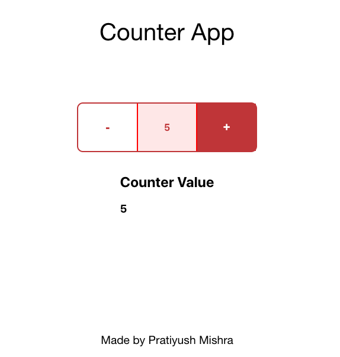

# Counter App

A counter app created using React.js (without external JS/CSS frameworks or libraries such as bootstrap, lodash, etc) that can increment or decrement a counter upon clicking the plus and minus buttons.

## Running Locally

In the project directory, you can run:

### `npm install`

### `npm start`

 

Runs the app in the development mode.\
Open [http://localhost:3000](http://localhost:3000) to view it in the browser.

The page will reload if you make edits.\
You will also see any lint errors in the console.

## Preview

 

